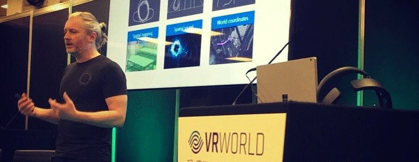

Hi, I'm Pete and love working on all aspects of 3D graphics but mostly in the immersive spatial computing space! My favourite tech includes: Mixed Reality, HoloLens, Unity, Unreal Engine, DirectX, Blender, Azure

[Here's](https://view.dimensionstudio.co/?&fileId=Microsoft_VIP/Microsoft_VIP_shot05_take03/web/video.hcap) my Mixed Reality Avatar!, [LinkedIn](https://www.linkedin.com/in/peterdaukintis/), [Blog](https://peted.azurewebsites.net/)

[Pete's Stats](https://github-readme-stats.vercel.app/api?username=peted70&theme=dark&show_icons=true&count_private=true)

<!--
**peted70/peted70** is a ✨ _special_ ✨ repository because its `README.md` (this file) appears on your GitHub profile.

Here are some ideas to get you started:

- 🔭 I’m currently working on ...
- 🌱 I’m currently learning ...
- 👯 I’m looking to collaborate on ...
- 🤔 I’m looking for help with ...
- 💬 Ask me about ...
- 📫 How to reach me: ...
- 😄 Pronouns: ...
- ⚡ Fun fact: ...
-->
